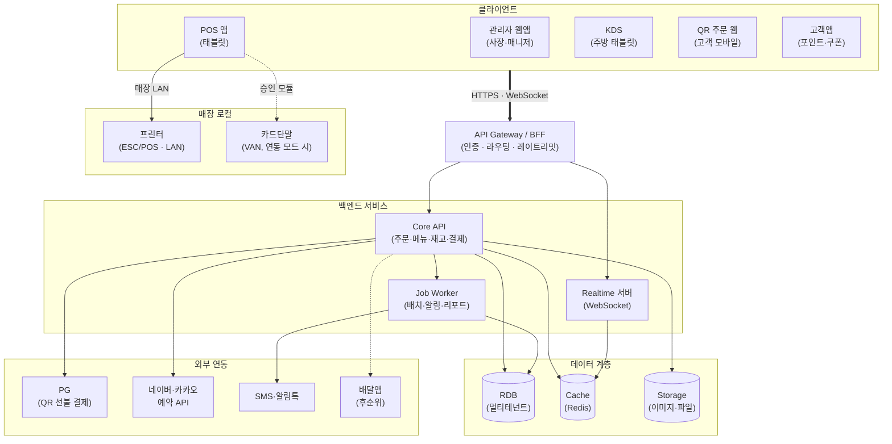
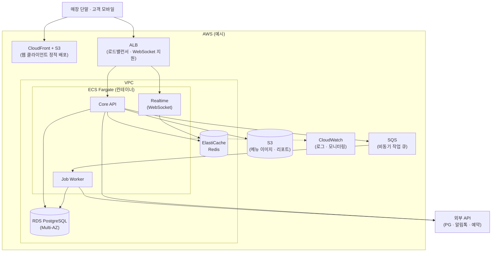

# 04. 시스템 아키텍처 (초안)

## 전체 구조 (논리적 뷰)

- 실선: 필수 연동 / 점선: 선택·후순위 연동
- 카드단말(VAN)은 서버가 아닌 **POS 앱이 매장 내에서 직접 통신** (미연동 모드에서는 이 연결 없음 — `09-research/02-payment-integration.md`)

## 배포 구성도 (예시 — AWS 기준)

> 인프라는 아직 미확정(AWS/GCP/NCP TBD)이므로, AWS를 가정한 **예시**입니다. 확정 시 갱신합니다.
> Mermaid의 클라우드 아이콘 다이어그램(`architecture-beta`)은 GitHub 렌더링 호환성이 아직 제한적이라 flowchart로 작성했습니다.

## 주요 컴포넌트

### 클라이언트
- **관리자 웹앱**: 사장/매니저용. 매출·직원·재고·예약 관리.
- **POS 단말**: 태블릿 기반. 주문·결제. 오프라인 대응 고려.
- **KDS 화면**: 주방 전용 디스플레이/태블릿.
- **QR 웹**: 고객이 QR 스캔 시 열리는 모바일 웹(앱 설치 불필요).
- **고객앱**: 포인트/쿠폰/예약/알림.

### 백엔드
- **API Gateway / BFF**: 인증, 라우팅, 클라이언트별 응답 가공.
- **Core API**: 도메인 로직(주문·메뉴·재고·결제 등).
- **Realtime 서버**: 주문·테이블 상태 실시간 푸시(WebSocket).
- **Job Worker**: 예약 리마인드, 마케팅 발송, 리포트 생성 등 비동기 작업.

### 데이터
- **RDB**: 주 데이터 저장소. 멀티테넌트 구조.
- **Cache**: 세션, 실시간 상태, 읽기 성능.
- **Storage**: 이미지(메뉴 사진), 파일(리포트 PDF 등).

### 외부 연동
- **PG사**: 카드·간편결제
- **예약 플랫폼**: 네이버/카카오 예약 API
- **알림**: SMS, 카카오 알림톡, 푸시
- **배달앱**: 배민/쿠팡이츠 등 (후순위)
- **프린터**: 매장 로컬 네트워크 내 ESC/POS 프린터

## 멀티테넌트 전략

| 옵션 | 장점 | 단점 |
|------|------|------|
| A. 공유 DB + 테넌트ID | 인프라 단순, 운영 비용 저렴 | 쿼리 실수 시 데이터 누출 위험 |
| B. 공유 DB + 스키마 분리 | 격리도 적당, 운영 중간 | DB별 연결 풀 관리 필요 |
| C. DB 분리 | 최고 격리도, 규제 대응 | 인프라 비용·복잡도 높음 |

**현재 권장**: 시작은 **A (공유 DB + 테넌트ID)**, 대형 고객은 추후 C로 이전 가능하도록 설계.

## 연결 방식

- **웹/모바일 ↔ 서버**: HTTPS + WebSocket(실시간)
- **POS ↔ 프린터**: 매장 LAN 또는 Bluetooth
- **KDS ↔ 서버**: WebSocket (주문 이벤트 수신)
- **POS 오프라인 대응**: 로컬 큐 → 네트워크 복구 시 동기화 (TBD)

## 보안 고려

- 테넌트 ID 필터를 모든 쿼리에 강제(ORM 미들웨어)
- 역할 기반 인가(RBAC) 체크
- 결제 정보는 PG사에 위임(자체 저장 X)
- 개인정보(고객·직원) 암호화 저장
- 접속/변경 감사 로그

## 미정 사항 (`07-open-questions.md` 참조)
- 프론트엔드/백엔드/DB/인프라 기술 스택
- 모바일: 네이티브 vs 크로스플랫폼 vs PWA
- 실시간 통신 방식(WebSocket vs SSE vs Polling)
- 오프라인 모드 범위
