# 08. 업무 워크플로우 다이어그램

비개발자(사장/직원/고객) 관점에서 실제 업무 흐름을 정리한 문서입니다.
Mermaid Sequence Diagram을 **Swim Lane** 형태로 사용하여, 각 역할 간 업무 이동을 시각적으로 보여줍니다.

---

## 1. 전체 흐름: 손님 방문 → 퇴장

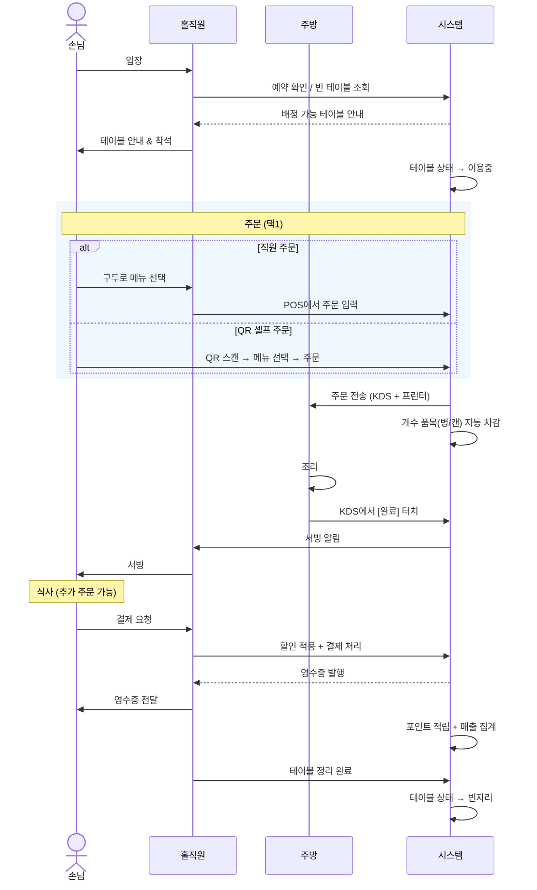

---

## 2. 직원 POS 주문 처리

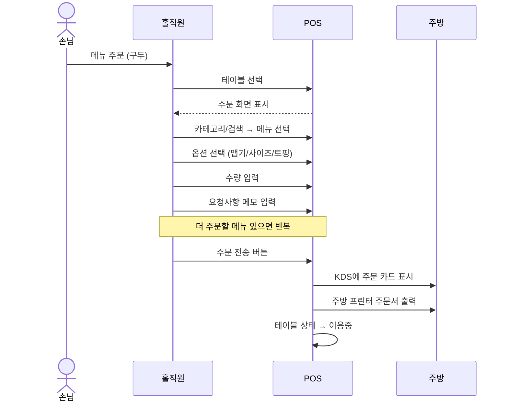

---

## 3. QR 셀프 주문

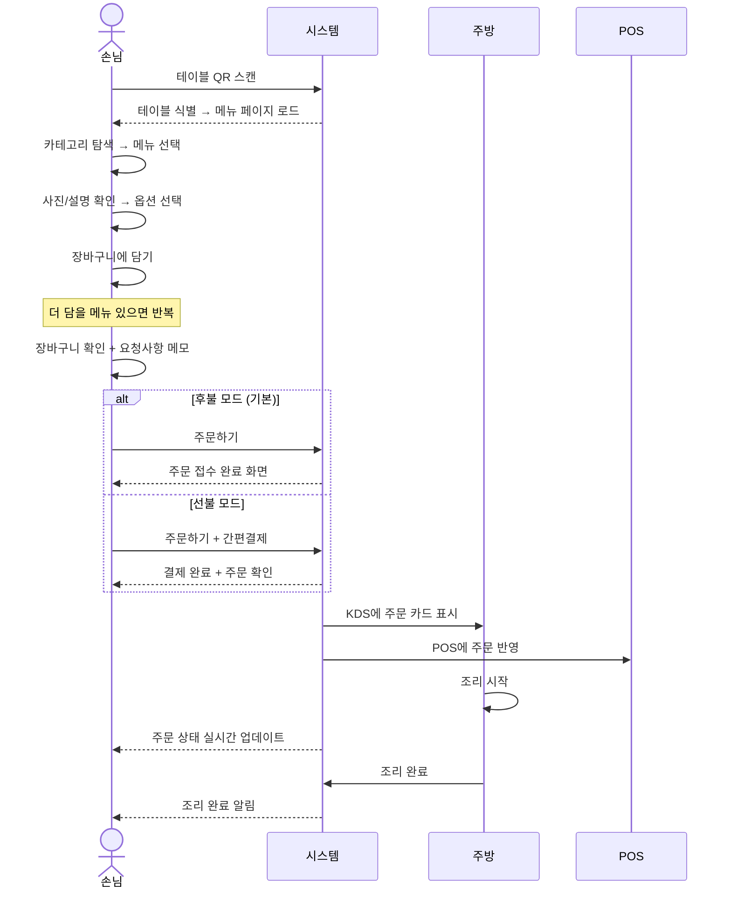

---

## 4. 주방 조리 흐름 (KDS)

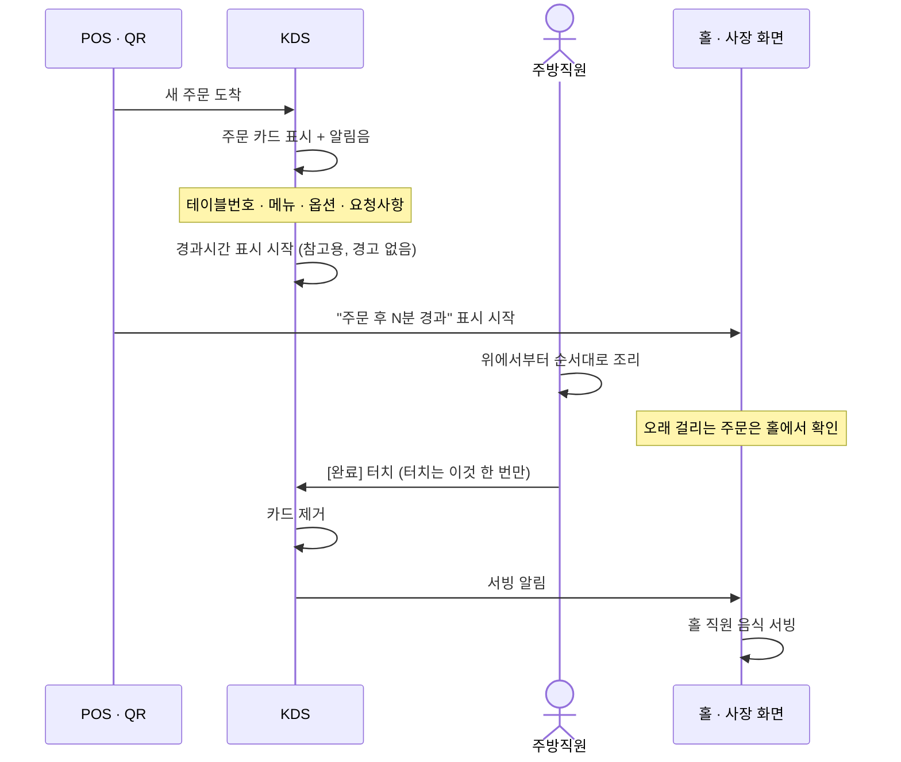

---

## 5. 결제 처리

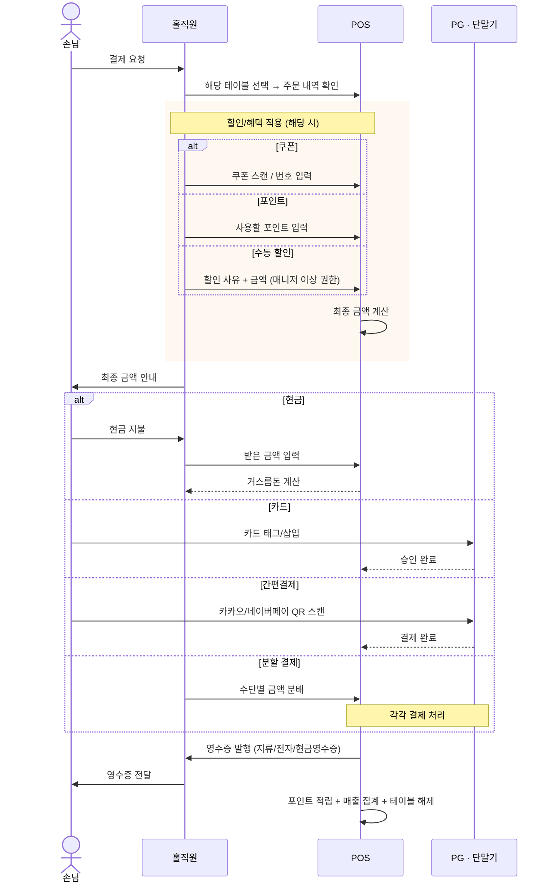

---

## 6. 예약 관리

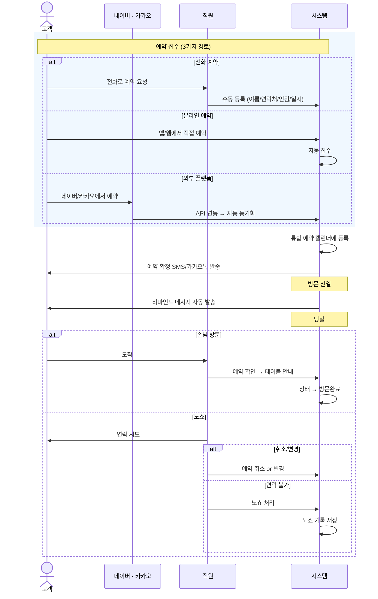

---

## 7. 재고 / 식자재 관리

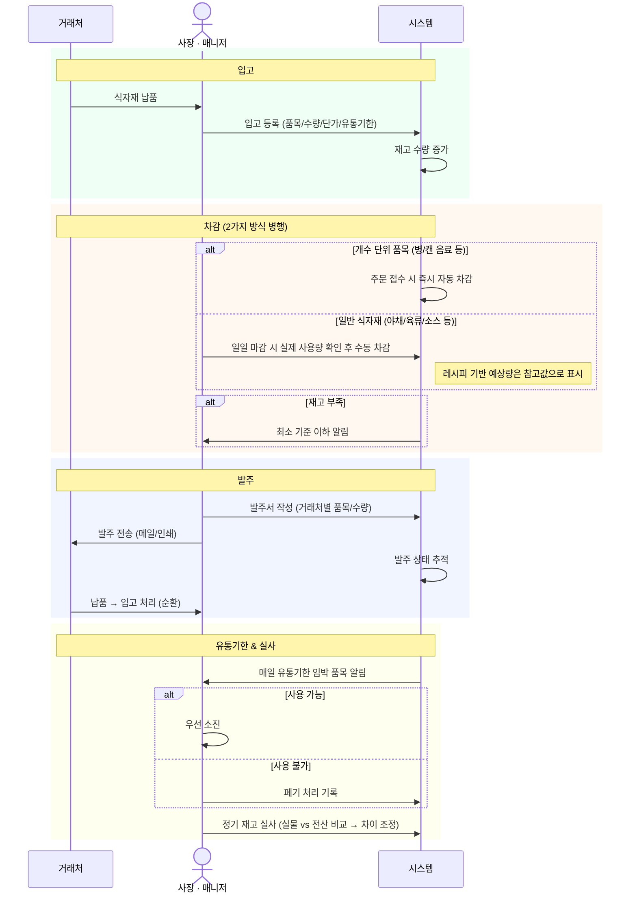

---

## 8. 직원 출퇴근 / 스케줄

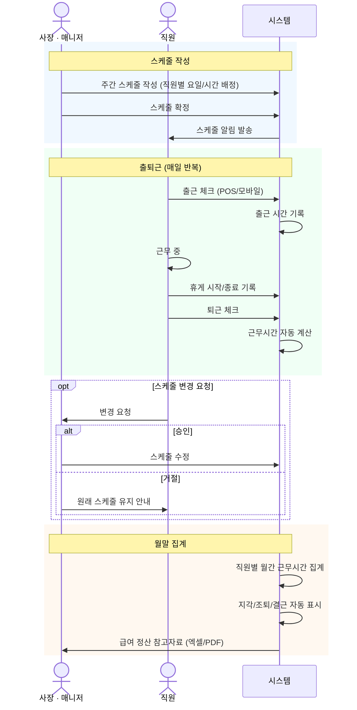

---

## 9. 포인트 / 쿠폰 / 마케팅

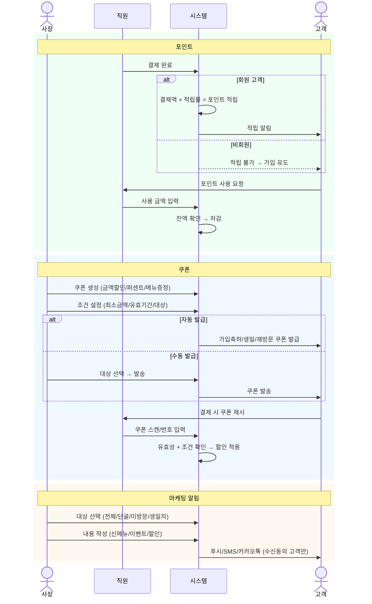

---

## 10. 가게 하루 운영

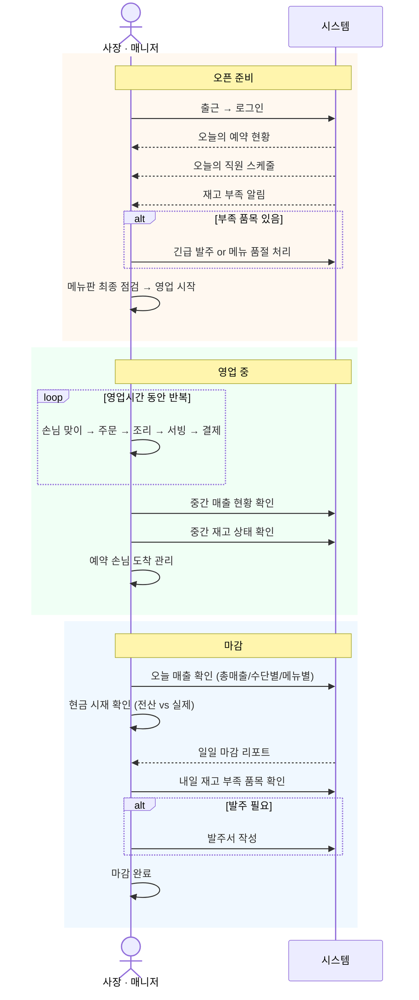

---

## 11. 메뉴 관리

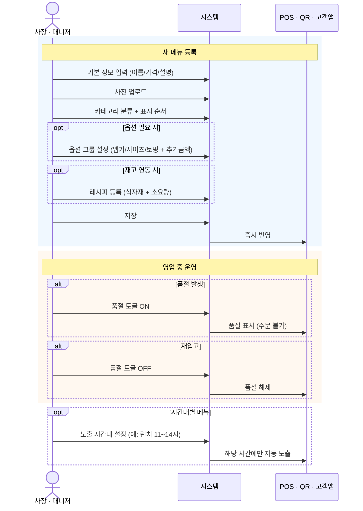

---

## 12. 테이블 관리

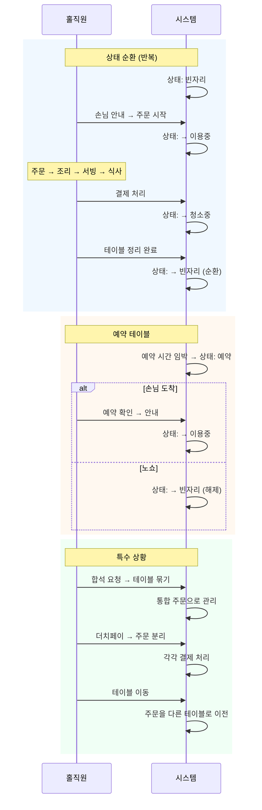
