# 08. 업무 워크플로우 다이어그램

비개발자(사장/직원/고객) 관점에서 실제 업무 흐름을 정리한 문서입니다.

---

## 1. 전체 흐름: 손님 방문부터 퇴장까지

가게에서 일어나는 전체 흐름을 한눈에 보여줍니다.

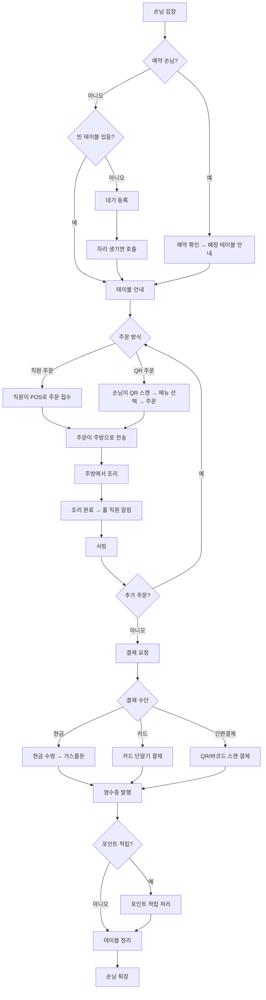

---

## 2. 직원 POS 주문 처리

직원이 POS를 사용해 주문을 받는 상세 흐름입니다.

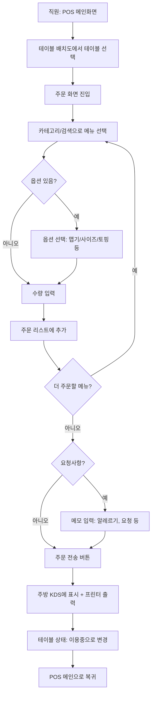

---

## 3. QR 셀프 주문 (고객 시점)

고객이 QR을 스캔해서 직접 주문하는 흐름입니다.

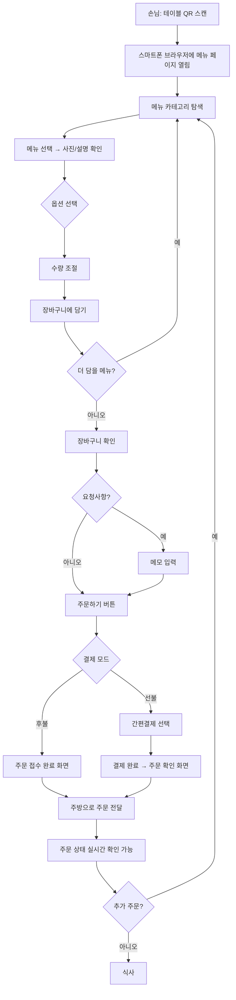

---

## 4. 주방 조리 흐름 (KDS)

주방 직원이 KDS 화면으로 주문을 확인하고 조리하는 흐름입니다.

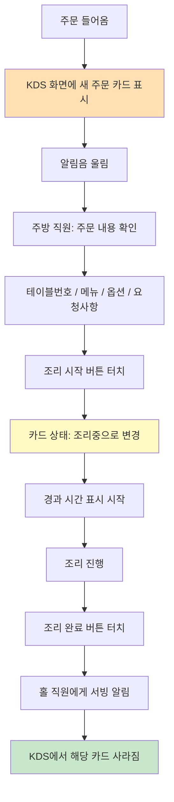

---

## 5. 결제 흐름

결제 처리의 상세 흐름입니다.

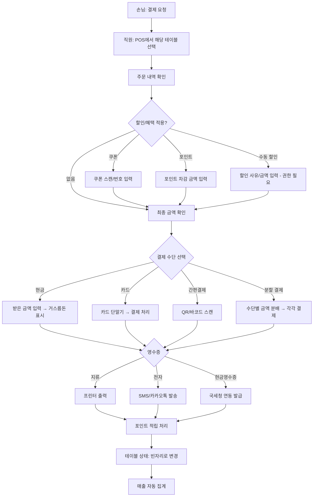

---

## 6. 예약 흐름

다양한 경로의 예약이 통합 관리되는 흐름입니다.

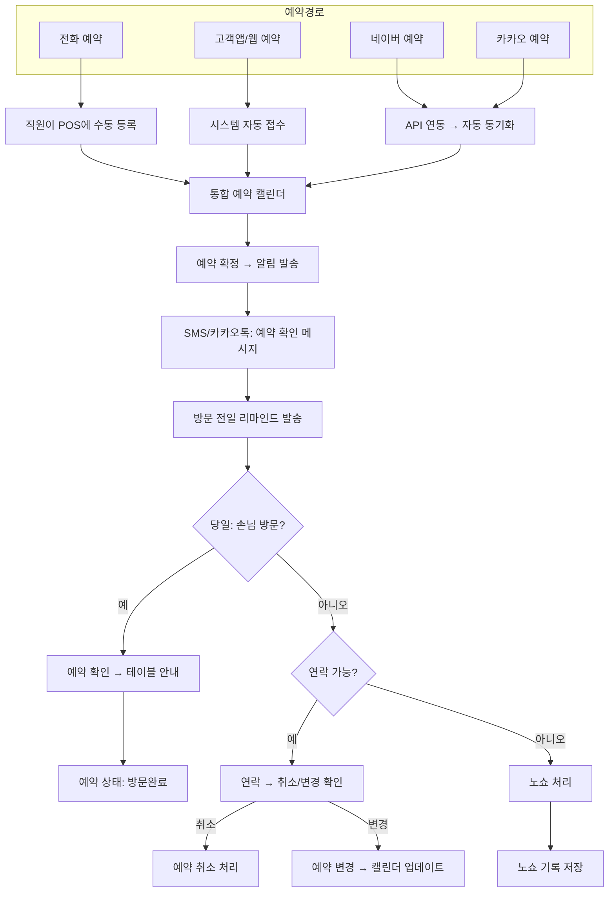

---

## 7. 재고/식자재 관리 흐름

식자재 입고부터 자동 차감, 발주까지의 흐름입니다.

```mermaid
flowchart TD
    subgraph 입고
        A1[거래처에서 식자재 도착]
        A1 --> A2[입고 수량/단가/유통기한 입력]
        A2 --> A3[재고 수량 증가]
    end

    subgraph 자동차감
        B1[손님 주문 접수]
        B1 --> B2[메뉴의 레시피 확인]
        B2 --> B3[필요 식자재 자동 차감]
        B3 --> B4{재고 부족?}
        B4 -- 예 --> B5[사장/매니저에게 알림]
        B4 -- 아니오 --> B6[정상 처리]
    end

    subgraph 발주
        C1[재고 부족 알림 수신]
        C1 --> C2[발주서 작성]
        C2 --> C3[거래처별 품목/수량 확인]
        C3 --> C4[발주 전송: 메일/출력]
        C4 --> C5[발주 상태: 대기중]
        C5 --> C6[거래처 납품 → 입고 처리]
    end

    subgraph 유통기한
        D1[매일 자동 체크]
        D1 --> D2{임박 식자재?}
        D2 -- 예 --> D3[알림: 유통기한 임박 품목]
        D3 --> D4{사용 가능?}
        D4 -- 예 --> D5[우선 사용 권장]
        D4 -- 아니오 --> D6[폐기 처리 기록]
    end

    subgraph 재고실사
        E1[정기 실사일]
        E1 --> E2[실제 수량 카운트]
        E2 --> E3[전산 재고와 비교]
        E3 --> E4{차이 있음?}
        E4 -- 예 --> E5[차이 조정 + 원인 메모]
        E4 -- 아니오 --> E6[실사 완료]
    end
```

---

## 8. 직원 출퇴근 / 스케줄 흐름

직원 근무 관리의 전체 흐름입니다.

```mermaid
flowchart TD
    subgraph 스케줄작성
        A1[사장/매니저: 주간 스케줄 작성]
        A1 --> A2[직원별 요일/시간 배정]
        A2 --> A3[스케줄 확정 → 직원에게 알림]
    end

    subgraph 출퇴근
        B1[직원 출근]
        B1 --> B2[출근 체크: POS/모바일에서 기록]
        B2 --> B3[근무 시작]
        B3 --> B4{휴게시간?}
        B4 -- 예 --> B5[휴게 시작/종료 기록]
        B5 --> B3
        B4 --> B6[퇴근 시간]
        B6 --> B7[퇴근 체크]
        B7 --> B8[근무시간 자동 계산]
    end

    subgraph 집계
        C1[월말]
        C1 --> C2[직원별 근무시간 집계]
        C2 --> C3[지각/조퇴/결근 표시]
        C3 --> C4[급여 정산 참고자료 출력]
    end

    subgraph 스케줄변경
        D1[직원: 스케줄 변경 요청]
        D1 --> D2[사장/매니저: 승인/거절]
        D2 -- 승인 --> D3[스케줄 업데이트]
        D2 -- 거절 --> D4[원래 스케줄 유지]
    end
```

---

## 9. 고객 포인트 / 쿠폰 흐름

고객이 포인트를 적립하고 쿠폰을 사용하는 흐름입니다.

```mermaid
flowchart TD
    subgraph 포인트적립
        A1[결제 완료]
        A1 --> A2{회원 고객?}
        A2 -- 예 --> A3[결제 금액 × 적립률 = 포인트 적립]
        A2 -- 아니오 --> A4[비회원: 적립 불가 안내]
        A4 --> A5{가입 유도}
        A5 -- 가입 --> A6[회원가입 → 적립]
        A5 -- 거부 --> A7[다음에]
    end

    subgraph 포인트사용
        B1[결제 시 포인트 사용 요청]
        B1 --> B2[보유 포인트 확인]
        B2 --> B3[사용할 포인트 입력]
        B3 --> B4[결제 금액에서 차감]
    end

    subgraph 쿠폰발행
        C1[사장: 쿠폰 생성]
        C1 --> C2[종류: 금액할인 / 퍼센트 / 메뉴증정]
        C2 --> C3[조건: 최소금액, 유효기간, 대상]
        C3 --> C4{발행 방식}
        C4 -- 자동 --> C5[가입축하/생일/재방문 자동 발급]
        C4 -- 수동 --> C6[대상 고객 선택 → 발송]
    end

    subgraph 쿠폰사용
        D1[결제 시 쿠폰 제시]
        D1 --> D2[쿠폰 스캔/번호 입력]
        D2 --> D3{유효한 쿠폰?}
        D3 -- 예 --> D4{사용 조건 충족?}
        D4 -- 예 --> D5[할인 적용]
        D4 -- 아니오 --> D6[조건 미충족 안내]
        D3 -- 아니오 --> D7[만료/사용완료 안내]
    end

    subgraph 마케팅알림
        E1[사장: 마케팅 발송 설정]
        E1 --> E2[대상 선택: 전체/단골/미방문/생일자]
        E2 --> E3[내용 작성: 신메뉴/이벤트/할인]
        E3 --> E4[발송: 푸시/SMS/카카오톡]
        E4 --> E5[수신 동의 고객에게만 전달]
    end
```

---

## 10. 가게 하루 운영 흐름 (오픈 → 마감)

사장/매니저 관점에서 하루 전체 운영 흐름입니다.

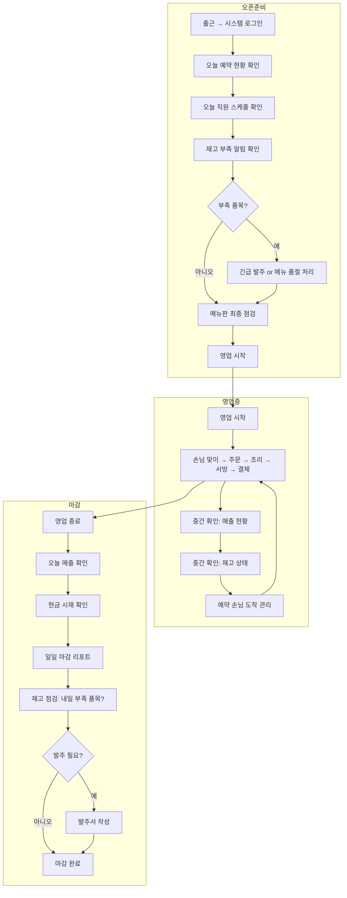

---

## 11. 메뉴 관리 흐름

메뉴를 등록하고 운영하는 흐름입니다.

```mermaid
flowchart TD
    subgraph 메뉴등록
        A1[사장: 새 메뉴 등록]
        A1 --> A2[기본 정보: 이름, 가격, 설명]
        A2 --> A3[사진 업로드]
        A3 --> A4[카테고리 분류]
        A4 --> A5{옵션 필요?}
        A5 -- 예 --> A6[옵션 그룹 설정: 맵기/사이즈/토핑]
        A5 -- 아니오 --> A7{레시피 등록?}
        A6 --> A7
        A7 -- 예 --> A8[식자재 + 소요량 매핑]
        A7 -- 아니오 --> A9[메뉴 저장 → 즉시 노출]
        A8 --> A9
    end

    subgraph 메뉴운영
        B1[영업 중 품절 발생]
        B1 --> B2[품절 토글 ON]
        B2 --> B3[POS + QR메뉴에 품절 표시]
        B3 --> B4[재입고 시 품절 해제]
    end

    subgraph 시간대메뉴
        C1[런치 전용 메뉴 설정]
        C1 --> C2[노출 시간대: 11:00~14:00]
        C2 --> C3[해당 시간에만 주문 가능]
    end

    subgraph 가격변경
        D1[가격 인상/할인]
        D1 --> D2[메뉴별 or 카테고리 일괄]
        D2 --> D3[변경 즉시 반영]
    end
```

---

## 12. 테이블 관리 흐름

테이블의 실시간 상태 변화 흐름입니다.

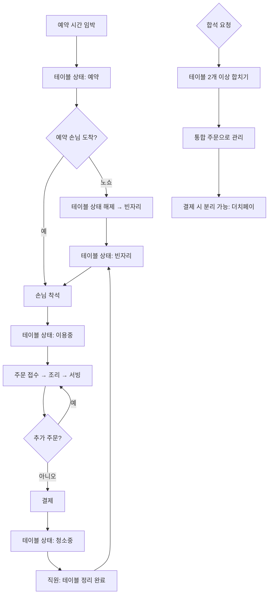
